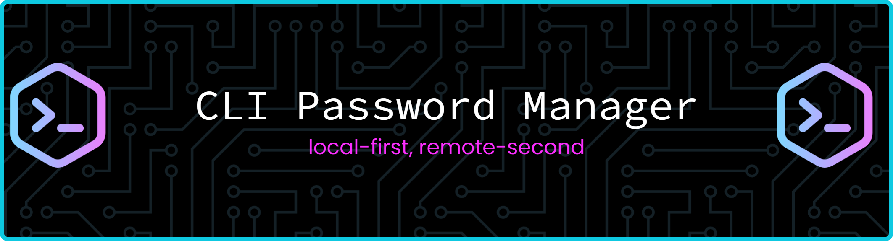

# CLI Password Manager

A Python password manager with:
- local encrypted vault storage
- master-password protection
- section-based organization
- field/value key-value storage
- optional remote backup sync through a Flask API

This project combines a local CLI for managing credentials with a lightweight API designed to back up and restore vault data across machines.

---

## Features

- Secure vault setup with a master password
- Argon2-based password hashing
- Fernet-based symmetric encryption for stored values
- Sections for grouping related credentials
- Fields for storing key/value entries
- Attempt-limit protection to lock or wipe vault data after repeated failures
- Email-based synchronization identity
- Remote upload/download sync via Flask endpoints
- CLI interface for everyday use

---

## Project Overview

This application is structured in three main layers:

1. CLI layer
   - Handles user commands
   - Routes actions to the correct bridge/controller

2. Service layer
   - Performs vault, encryption, and sync logic
   - Implements core password management behavior

3. API layer
   - Exposes upload/download endpoints
   - Stores user backups under a per-user directory
   - Verifies user access using the configured password and email hash

---

## Architecture

### CLI
The interactive command-line interface is implemented in the `interface` package.

Typical commands look like:

```bash
python main.py config init
python main.py config attempt_limit "limit value"
python main.py config email "your email"

python main.py section create "section name"
python main.py section ls
python main.py section rm "section name"

python main.py field set "section name" "field name" "value"
python main.py field get "section name" "field name"
python main.py field ls --values
python main.py field rm "section name" "field name"

python main.py sync push
python main.py sync pull